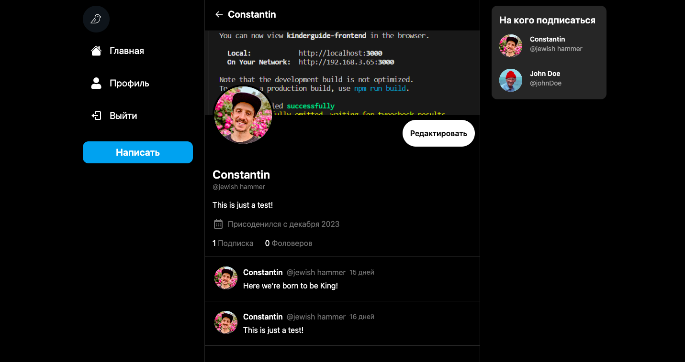

# Разработка fullstack приложения: Chirper c помощью: React, Tailwind, Next.js, Prisma, MongoDB, NextAuth и Vercel




Chirper - одностраничное приложение: микро-блоггинг и соц. сеть где пользователи транслируют короткие сообщения. Данный пэт-проект был выполнен в целях изучения TailwindCSS и Next.js. Бэкенд сторона (Prisma, MongoDB, NextAuth) была настроена с помощью туториала.


Что было сделано мною:

- Адаптивная верстка
- Загрузка изображений с компьютера напрямую
- Настройка Prisma ORM и MongoDB (с помощью туториала)
- Система аутентификации (с помощью туториала)
- Запросы Api (с помощью туториала)
- Деплой на Vercel


### Клонирование репозитория

```shell
git clone https://github.com/KonstaBartosh/chirper.git
```

### Установка пакетов

```shell
npm i
```

### Настройте .env файл


```js
DATABASE_URL=
NEXTAUTH_JWT_SECRET=
NEXTAUTH_SECRET=
```

### Запуск приложения

```shell
npm run dev
```